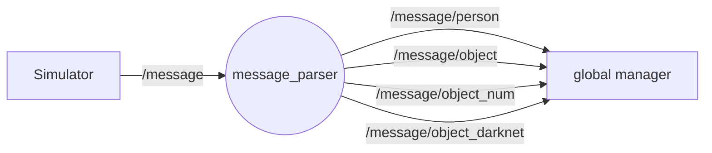

# Message Parser

##

`/message/person` possible values :  
- "pending"
- "left"
- "right"
- "undefined"

`/message/object` possible values :  
- "pending"
- label given by /message and matching with the ycb dataset
- "undefined"

`/message/object_num` possible values :  
- -1 :  pending
- 0 : undefined
- 1-77 : ycb object number  

`/message/object_darknet` possible values :  
- "pending"
- label from darknet classes
- "undefined"

If you receive "pending" or -1, wait for receiving /message  

