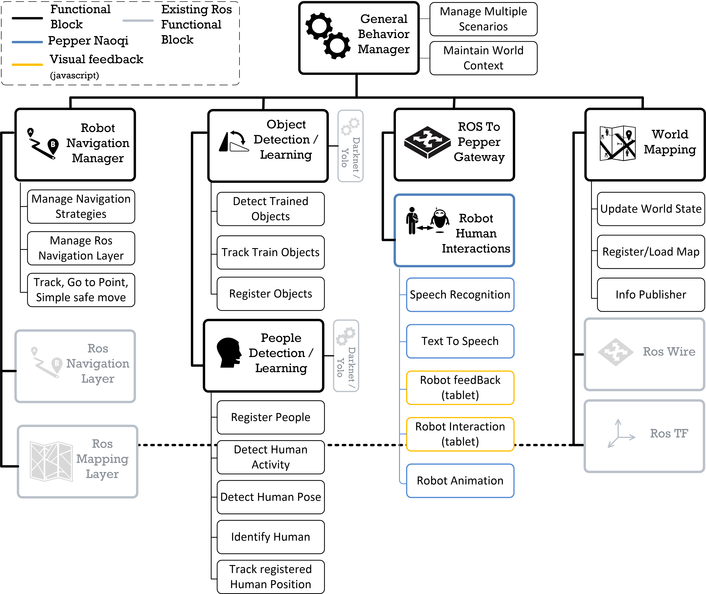
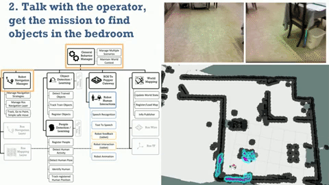

# general_mng

## 1. Description
This package is in charge of managing all capacity blocks of the architecture 
,



The main goal of the general manager is to provide a high level robot scenario description, managing possible retry, timeout, failures, ...
All scenarios extend abstract scenarios (AbstractScenarioBus, AbstractScenarioAction). These abstractions give the ability to use both topic communication and action call with capacity blocks
Currently the Action call is mainly developed. <br/>
The scenario to execute is specified in the configuration file.<br/>
The scenario start if a 'START' is received on the /gm_start topic. Note that the pepper_door_open_detection node (navigation_manager package) could start the scenario if a min distance of k is detected in front of the robot.


 


A complete video demonstration is available [here](https://youtu.be/rouCK6CH_eM)

## 2. Authors
* Jacques Saraydaryan

## 3. How to quote
F. Jumel, J. Saraydaryan, R. Leber, L. Matignon, E. Lombardi, C. Wolf and O. Simonin,”Context Aware Robot Architecture, Application to the Robocup@Home Challenge”, RoboCup Symposium 2018

## 4.  Configuration 

The common_gm.yaml file:
```python
  GeneralManager:
    # folder where json file of your scenario is located
    config_folder: '../data/general_management'
    # your scenario key, this key is set in the GeneralManager.py file when your scenario is created
    current_scenario: 'TEST_COCKTAIL_PARTY_V2'
  
```

## 5.  Scenario creation procedure

### 5.1 Create a Scenario File
Go to the scripts/scenario folder
Create a new file e.g MyScenario.py

```python
__author__ = 'Jacques Saraydaryan'
from abc import ABCMeta, abstractmethod
import rospy
import actionlib

from AbstractScenarioBus import AbstractScenarioBus
from AbstractScenarioAction import AbstractScenarioAction
from AbstractScenario import AbstractScenario

class MyScenario(AbstractScenario,AbstractScenarioBus,AbstractScenarioAction):

    _severalActionPending={}
    _oneActionPending=None

    def __init__(self,config):
        AbstractScenarioBus.__init__(self,config)
        AbstractScenarioAction.__init__(self,config)
        ## Add your code here


    def startScenario(self):
        rospy.loginfo("")
        rospy.loginfo("######################################")
        rospy.loginfo("Starting the MyScenario Scenario...")
        rospy.loginfo("######################################")
        
        
        ## Add your code here
        # e.g got to a point using action of navigation_manager package
        self.sendNavOrderActionToPt("NP","CRRCloseToGoal",7,7,60.0)
        
        # e.g turn of 180° using action of  navigation_manager package
        self.sendNavOrderAction("NT","","",60.0)
        

    def initScenario(self):
        AbstractScenarioAction.configure_intern(self)

```

Create a json configuration file if needed into the config_folder directory, e.g MYSCENARIO_SCENARIO.json
```json
{
    "name":"MyScenario_",
    "description":"configuration needed for MyScenario_",
    "it_list": ["A_sim","B_sim","C_sim","F_sim"]
}
```


Update the GeneralManager.py file
```python
...
from scenario.MyScenario import MyScenario
...

    def configure(self):
       ...
        self._scenarioMap["MYSCENARIO"]=MYSCENARIO(currentConfig)
       ...

```

Update the general_manager configuration  common_gm.yaml

```python
  GeneralManager:
    config_folder: '../data/general_management'
    current_scenario: 'MYSCENARIO'
  
```

Launch the general_manager your scenario is ready to be executed
```
roslaunch general_mng general_manager.launch
```


